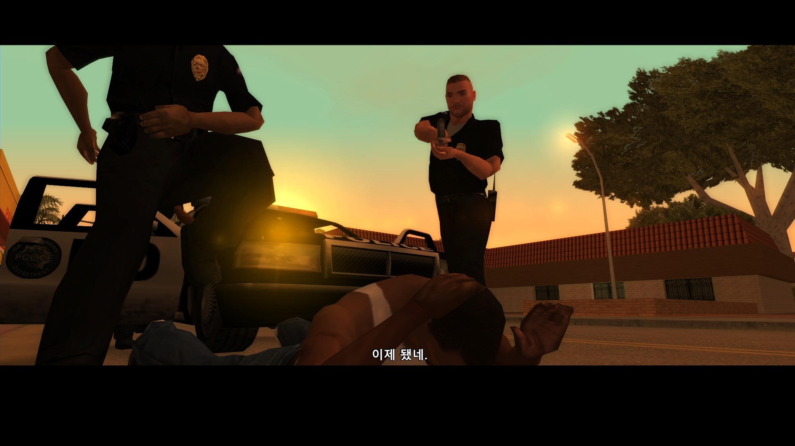

# GTA 산안드레아스 한글 자막 오버레이 (작업 중)

GTA 산안드레아스(1.0 US)의 기존 자막 시스템은 한글을 자모 단위로
풀어쓰기해서 저장해두고, 폰트(`fonts.txd`) 글리프만 조합해 화면에서
모아쓰기처럼 "보이게" 만드는 방식입니다. 이 modloader용 ASI 플러그인은
이 방식의 한계로 인해 깨지는 자막 렌더링 문제를 고쳐서, 실제로 완성된
모아쓰기 한글 음절로 조합한 뒤 오버레이 형태로 자막을 다시 그려줍니다.

일반 사용자를 위한 쉬운 설명은 [docs/가이드.md](docs/가이드.md)를 참고하세요.
이 문서는 빌드/개발 관련 내용을 다룹니다.

## 스크린샷



대사가 오버레이로 정상적으로 렌더링되는 모습입니다.

## 문제 상황

한글패치의 `fonts.txd`는 진짜 텍스트 인코딩이 아니라 "자모조합형" 폰트입니다
(옛날 콘솔 게임의 한글 폰트 방식과 동일). GXT 대사 문자열의 바이트 하나하나가
완성된 글자가 아니라, 라틴/ASCII 글리프이거나(`0x80` 미만) `0x80` 이상
범위에서는 초성/중성/종성 자모 조각 하나를 가리킵니다. 게임의 기본
렌더러는 이 조각 2~4개를 간격을 좁혀 겹쳐 그려서 한글 음절처럼 흉내
내는데, 진짜 글꼴 차원의 조합이 아니라 조각을 억지로 가까이 붙여놓은
것뿐이라 정렬이 딱 맞지 않고 삐딱하게 기울어져 보입니다. 이 원본 바이트를
"텍스트로" 다루려는 시도(복사해서 붙여넣기, 원래의 글리프-오버레이
렌더러가 아닌 다른 도구로 표시 등)는 아예 깨진 결과를 냅니다.

## 이 플러그인이 하는 일

매 프레임마다 `CMessages::BIGMessages` / `BriefMessages`에서 이미
게임이 결정해놓은 자막 문자열을 직접 읽어와서, 자모조합 바이트 시퀀스를
직접 디코딩해 진짜 유니코드 한글 음절로 변환한 뒤, 시스템에 있는 한글
트루타입 글꼴(맑은 고딕)을 이용해 Dear ImGui로 화면에 그립니다. 이
그리기는 게임 자체의 기울어진 자막 그리기 호출 위에 덧그려지며, 사실상
그것을 완전히 대체합니다.

디코딩 테이블(`src/dllmain.cpp`)은 한글패치의 `fonts.txd` 글리프 격자를
직접 눈으로 확인하고 실제 대사와 대조하는 방식으로 역공학했으며, 이후
`american.gxt`에 들어있는 전체 대사 문자열(모든 127개 GXT 테이블 기준
한글 인코딩 문자열 1775개)을 오프라인에서 같은 디코더로 전수 검사해서
매핑 안 된 바이트가 하나도 남지 않을 때까지 검증했습니다.

## 주요 기능

- 자모조합 바이트를 실시간으로 완성형 한글 음절로 디코딩
- 굵은 맑은 고딕(malgunbd.ttf) + 검은 윤곽선으로 가독성 있게 렌더링
- 게임 옵션에서 "자막"을 꺼놔도, NPC 간 대사(예: Ryder ↔ CJ 미션 인트로 대화)까지
  전부 표시되도록 자막 설정을 매 프레임 강제로 켬
  (`ForceSubtitlesPref`, `PrefsShowSubtitles` - 주소는 미검증, 코드 주석 참고)
- MISSION PASSED / BUSTED / WASTED처럼 원래 영어인 배너는 오버레이가 건드리지
  않고 게임 기본 렌더링을 그대로 사용
- ESC(일시정지) 메뉴가 열려 있는 동안은 오버레이를 숨기고, 메뉴를 닫으면
  자동으로 다시 표시
- 대사 A → B 전환 시 이전 대사가 잠깐 겹쳐 보이거나 다음 줄이 잘려 보이는
  현상을 두 가지 원인 모두 수정 (네이티브 렌더러가 자기 타이머로 이전 줄을
  더 붙들고 있는 문제, ImGui 창 자동 리사이즈가 한 프레임 늦게 반영되는 문제)

## 의존성

**런타임 의존성** (플레이할 때 반드시 있어야 함)
- GTA 산안드레아스 1.0 US + [modloader](https://gtaforums.com/topic/577721-relmod-modloader/)
- 커뮤니티 한글패치 (`fonts.dat`, `fonts.txd`, `american.gxt`)가 이미
  설치되어 있을 것 - 이 플러그인은 한글패치가 이미 깔아놓은 자막 원본
  바이트를 읽어서 다시 그리는 것이지, 번역 자체를 갖고 있지 않습니다.
  한글패치 없이 이 플러그인만 설치하면 아무 효과가 없습니다.

**빌드 의존성** (직접 빌드할 때만 필요)
- Windows, MSVC v143 툴셋 (Visual Studio 2022)
- [Dear ImGui](https://github.com/ocornut/imgui) (1.92.9 WIP 기준 테스트), DX9 백엔드(`imgui_impl_dx9`) 포함
- [MinHook](https://github.com/TsudaKageyu/minhook) 1.3 (소스에서 직접 빌드, 정적 링크)
- DirectX 9 (`d3d9.lib`, Windows SDK에 포함됨)

MinHook과 Dear ImGui는 이 저장소에 **포함되어 있지 않습니다** - 프로젝트
파일이 옆 디렉터리에서 소스를 직접 컴파일하는 구조입니다:

```
GTA-SA-Dev/
├── KoreanSubtitleOverlay/   (이 저장소)
├── imgui/                   (github.com/ocornut/imgui)
└── minhook/                 (github.com/TsudaKageyu/minhook)
```

빌드 전에 두 저장소를 이 저장소 옆에 clone 해두세요.

## 빌드 방법

1. `imgui`와 `minhook`을 이 저장소와 같은 위치에 clone 합니다 (위 구조 참고).
2. `KoreanSubtitleOverlay.vcxproj`를 Visual Studio 2022로 엽니다.
3. `Release|Win32`로 빌드합니다 (GTA SA는 32비트 게임입니다).
4. 결과물: `bin/KoreanSubtitleOverlay.asi`.

## 설치 방법

필요한 것:
- [modloader](https://gtaforums.com/topic/577721-relmod-modloader/)가 설치된 GTA 산안드레아스 1.0 US.
- 한글패치가 이미 설치되어 있을 것 (`fonts.dat`, `fonts.txd`,
  `american.gxt`가 자리에 있어야 함 - 이 플러그인은 자막 *렌더링*만
  고치는 것이지, 스스로 한글 번역을 추가하지는 않습니다).

순서:
1. `KoreanSubtitleOverlay.asi`를 빌드하거나 다운로드합니다.
2. GTA SA 설치 폴더의
   `modloader/_BASIC/KoreanSubtitleOverlay/KoreanSubtitleOverlay.asi`
   위치로 복사합니다.
3. 게임을 실행합니다. 문제가 생기면 `.asi` 옆에 `KoreanSubtitleOverlay.log`가
   생성되어 초기화/디버그 로그를 확인할 수 있습니다.

후킹 지점(EndScene/Reset/CMessages::Display), 오버레이 렌더링 구조,
개발용 도구(gxt_scan, FontExtract) 사용법은
[docs/DEVELOPER_GUIDE.md](docs/DEVELOPER_GUIDE.md)를 참고하세요.

전체 바이트 매핑 근거표, 시행착오 기록, 그리고 이 자막 오버레이와는
별개로 WASTED/BUSTED/지역명/차량명 등 `fonts.txd` 기반 UI 텍스트에
한글패치와 고해상도 폰트 모드를 동시에 적용한 방법은
[docs/WORK_LOG.md](docs/WORK_LOG.md)에 정리되어 있습니다.

## 알려진 제한사항

종성/겹모음 테이블의 모든 바이트는 실제 대사 텍스트 대조, FontExtract를
통한 직접 글리프 비교, 또는 둘 다를 통해 확인되었습니다 - `src/dllmain.cpp`의
`finalJamoForByte()` / `combineMedial()` 주석을 참고하세요. "Ryder" 미션
인트로까지 직접 플레이하며 오버레이 렌더링 결과를 스크린샷/영상으로도
확인했습니다.

GTA SA 스팀버전 자체 테스트는 아직 예정 단계입니다. 지금까지는 이미
exe가 패치된(위젯스크린/ASI 로더 지원용, 게임 폴더의 `gta-sa.exe.bak`
참고) 개발/테스트 설치본에서만 확인했고, 순정 스팀 설치본에서 별도
검증은 안 했습니다. `src/sa_messages.h`의 메모리 주소들이 문제없을
가능성이 높지만(이런 exe 로더 패치는 보통 게임 코드 자체를 재배치하지
않음), 혹시 몰라 코드에도 주의사항으로 남겨뒀습니다.

<!-- GTA Vice City 포팅 가능성 조사(파일 확보 시도, plugin-sdk SA/VC 구조 비교)는 extra_docs/VC_PORTABILITY.md 참고 -->
